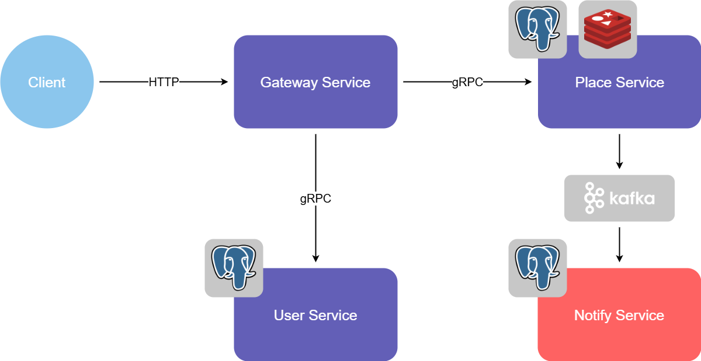

# :whale: Date Wishlist Hub Deploy

Центральный репозиторий проекта **Date Wishlist Hub**([общая канбан-доска](https://github.com/users/alexgul25/projects/2)).

## :bulb: Идея проекта

**Data Wishlist Hub** - сервис, где каждый пользователь ведёт свой вишлист мест, которые он хотел бы посетить. Пользователи могут просматривать вишлисты, чтобы выбрать идею для совместной прогулки. Есть возможность подписки на пользователя, что позволяет получать уведомления на почту о появлении новых мест в вишлисте интересующего пользователя (на данном этапе письма на почту симулируются с помощью логирования).

## :jigsaw: Используемые микросервисы

- :globe_with_meridians: **[Gateway Service](https://github.com/alexgul25/gateway-svc)** - единая точка входа, через которую клиенты взаимодействуют со всеми внутренними сервисами.

- :round_pushpin: **[Place Service](https://github.com/alexgul25/place-svc)** - работа с данными о местах, добавленных пользователями.

- :busts_in_silhouette: **[User Service](https://github.com/alexgul25/user-svc)** - работа с данными о пользователях и подписках.

- :bell: **[Notify Service](https://github.com/alexgul25/notify-svc)** - асинхронная отправка уведомлений.

- :point_right: **[Protos](https://github.com/alexgul25/protos)** - общие `.proto` контракты.

## :building_construction: Архитектура проекта

<!-- markdownlint-disable MD033 -->

  <picture>
    <source media="(prefers-color-scheme: dark)" srcset="docs/Date_Wishlist_hub_dark_v2.png">
    <source media="(prefers-color-scheme: light)" srcset="docs/Date_Wishlist_hub_light_v2.png">
    
  </picture>

<!-- markdownlint-enable MD033 -->

## :world_map: План развития проекта

С задачами проекта, находящимися в работе прямо сейчас, можно ознакомиться на [канбан-доске](https://github.com/users/alexgul25/projects/2).

***Общие идеи для развития проекта в будущем.***

- Unit-тесты для бизнес-логики сервисов.

- Интеграционные тесты с testcontainers.

- Сбор метрик (Prometheus + Grafana).

- Реализация пользовательского интерфейса и запуск на сервере.
