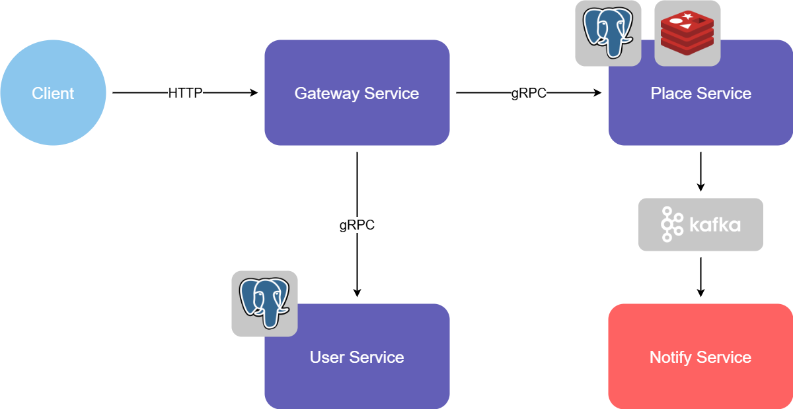

# Date Wishlist Hub

Центральный репозиторий проекта **Date Wishlist Hub**

## Используемые микросервисы

- :point_right: [Gateway Service](https://github.com/alexgul25/gateway-svc) - единая точка входа, через которую клиенты взаимодействуют со всеми внутренними сервисами

- :point_right: [User Service](https://github.com/alexgul25/user-svc) - работа с данными о пользователях и подписках

- :point_right: [Place Service](https://github.com/alexgul25/place-svc) - работа с данными о местах, добавленных пользователями

- Notify Service (ещё создаётся)

## Идея проекта

**Data Wishlist Hub** - сервис, где каждый пользователь ведёт свой вишлист мест, которые он хотел бы посетить. Пользователи могут просматривать вишлисты, чтобы выбрать идею для совместной прогулки. Есть возможность подписки на пользователя, она позволяет получать уведомления на почту о появлении новых мест в вишлисте интересующего пользователя (на данном этапе письма на почту симулируются с помощью логирования).

## Архитектура проекта

<!-- markdownlint-disable MD033 -->

  <picture>
    <source media="(prefers-color-scheme: dark)" srcset="docs/Date_Wishlist_hub_dark.png">
    <source media="(prefers-color-scheme: light)" srcset="docs/Date_Wishlist_hub_light.png">
    
  </picture>

<!-- markdownlint-enable MD033 -->
