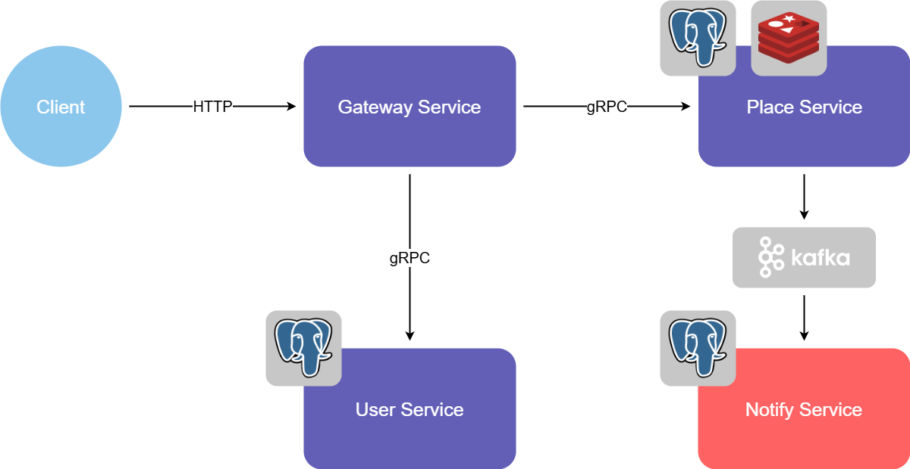

# :whale: Date Wishlist Hub Deploy

Центральный репозиторий проекта **Date Wishlist Hub**.

Ссылка на канбан-доску проекта: **[Date Wishlist Hub - Development](https://github.com/users/alexgul25/projects/2)**

*Общий стек технологий проекта:* `Go` `PostgreSQL` `Redis` `Kafka` `HTTP` `gRPC` `Protobuf`

## :bulb: Идея проекта

**Data Wishlist Hub** - сервис, где каждый пользователь ведёт свой вишлист мест, которые он хотел бы посетить. Пользователи могут просматривать вишлисты, чтобы выбрать идею для совместной прогулки. Есть возможность подписки на пользователя, что позволяет получать уведомления на почту о появлении новых мест в вишлисте интересующего пользователя (на данном этапе письма на почту симулируются с помощью логирования).

## :jigsaw: Используемые микросервисы

- :globe_with_meridians: **[Gateway Service](https://github.com/alexgul25/gateway-svc)** - единая точка входа, через которую клиенты взаимодействуют со всеми внутренними сервисами.

- :round_pushpin: **[Place Service](https://github.com/alexgul25/place-svc)** - работа с данными о местах, добавленных пользователями.

- :busts_in_silhouette: **[User Service](https://github.com/alexgul25/user-svc)** - работа с данными о пользователях и подписках.

- :bell: **[Notify Service](https://github.com/alexgul25/notify-svc)** - асинхронная отправка уведомлений.

- :scroll: **[Protos](https://github.com/alexgul25/protos)** - общие `.proto` контракты.

## :building_construction: Архитектура проекта

<!-- markdownlint-disable MD033 -->
<p align="center">
  <picture>
    <source media="(prefers-color-scheme: dark)" srcset="docs/Date_Wishlist_hub_dark_v2.png">
    <source media="(prefers-color-scheme: light)" srcset="docs/Date_Wishlist_hub_light_v2.png">
    
  </picture>
</p>
<!-- markdownlint-enable MD033 -->

## :desktop_computer: Локальный запуск и работа через терминал

### 1. Подготовка окружения

В вашем дистрибутиве должны быть установлены и готовы к работе:

- Go (версия 1.26.3+);

- утилита `goreman`;

- сервер PostgreSQL (версия 13+) и утилита `psql`;

- сервер Redis (версия 7+);

- сервер Kafka (версия 4.0+);

- компилятор Protocol Buffers (`protoc`);

- утилита `curl`;

- утилита `jq`;

- утилита `make`.

### 2. Клонирование нужных репозиториев

***ВАЖНО!*** Репозитории должны быть клонированы **в одну и ту же папку**. Всего необходимо клонировать 5 репозиториев.

- :whale: **Date Wishlist Hub Deploy** (этот репозиторий).

```bash
git clone https://github.com/alexgul25/date-wishlist-hub-deploy.git
```

```bash
git clone git@github.com:alexgul25/date-wishlist-hub-deploy.git
```

- :globe_with_meridians: **Gateway Service**.

```bash
git clone https://github.com/alexgul25/gateway-svc.git
```

```bash
git clone git@github.com:alexgul25/gateway-svc.git
```

- :round_pushpin: **Place Service**.

```bash
git clone https://github.com/alexgul25/place-svc.git
```

```bash
git clone git@github.com:alexgul25/place-svc.git
```

- :busts_in_silhouette: **User Service**.

```bash
git clone https://github.com/alexgul25/user-svc.git
```

```bash
git clone git@github.com:alexgul25/user-svc.git
```

- :bell: **Notify Service**.

```bash
git clone https://github.com/alexgul25/notify-svc.git
```

```bash
git clone git@github.com:alexgul25/notify-svc.git
```

### 3. Настройка инфраструктуры

#### 3.1. PostgreSQL

Запустите сервер PostgreSQL, затем создайте пользователей и базы данных для **Place Service**, **User Service** и **Notify Service**.

<!-- markdownlint-disable MD033 -->
<details>
<summary>Примечание</summary>

Рекомендуется создать 3 разных пользователя и аналогично 3 БД, но если совсем лень, всё будет работать (❓) и для одного экземпляра 😁.

</details>
<!-- markdownlint-enable MD033 -->

```bash
sudo -u postgres psql -c "CREATE USER <имя пользователя> WITH PASSWORD '<пароль>';"
```

```bash
sudo -u postgres psql -c "CREATE DATABASE <имя БД> OWNER <имя пользователя>;"
```

Проверьте доступ.

```bash
psql -h localhost -U <имя пользователя> -d <имя БД> -c "SELECT 1;"
```

Если всё работает корректно, вы увидите следующий вывод:

```bash
 ?column? 
----------
        1
(1 row)
```

#### 3.2. Kafka

Запустите сервер Kafka. Если у вас отключено автоматическое создание топиков, создайте их самостоятельно (названия топиков см. в **[topics.go](https://github.com/alexgul25/place-svc/blob/main/internal/outbox/topics.go)**).

#### 3.3. Redis

Запустите сервер Redis. Затем можно создать пользователя и пароль для **Place Service**, но при локальной работе это необязательно :grin:.

#### 3.4. Файлы конфигураций сервисов

***ВАЖНО!*** Создайте в корневой папке каждого из четырёх сервисов файл `.env` для переменных окружения и заполните их в следующем порядке.

1. **User Service**.

2. **Place Service**.

3. **Notify Service**. `USER_SERVICE_ADDR` = `localhost:<порт, указанный для User Service>`.

4. **Gateway Service**. `JWT_SECRET` должен совпадать с указанным для User Service; `USER_SERVICE_ADDR` = `localhost:<порт, указанный для User Service>`; `PLACE_SERVICE_ADDR` = `localhost:<порт, указанный для Place Service>`.

<!-- markdownlint-disable MD033 -->
<details>
<summary>Подсказки</summary>

Переменные `DB_USER`, `DB_PASSWORD` и `DB_NAME`:

- используются в **Place Service**, **User Service** и **Notify Service**;
- заполняются значениями из шага [3.1.](#31-postgresql)

Переменная `KAFKA_PRODUCER_BROKERS`:

- используется в **Place Service**;
- заполняется значениями из шага [3.2.](#32-kafka)

Переменная `KAFKA_CONSUMER_BROKERS`:

- используется в **Notify Service**;
- заполняется значениями из шага [3.2.](#32-kafka)

Переменные `REDIS_CACHE_ADDR`, `REDIS_CACHE_PASSWORD`, `REDIS_CACHE_USERNAME`:

- используется в **Place Service**;
- заполняется значениями из шага [3.3.](#33-redis) Если не создали пользователя и пароль, оставьте соответствующие переменные пустыми.

</details>
<!-- markdownlint-enable MD033 -->

### 4. Запуск и работа

Для удобства локальной работы в корне репозитория определён Makefile.

1. `make help` - узнайте о доступных командах.

2. `make run` - примените миграции для сервисов, использующих PostgreSQL; соберите все бинарники и запустите систему.

3. `Ctrl + C` - отправьте системе сигнал завершения, когда закончите работу.

В отдельном терминале перейдите в корневую папку **Gateway Service** и посылайте запросы.

- `make register` - зарегистрируйте пользователя.

- `make login` - авторизуйтесь (для удобства полученный JWT-токен будет сохранен в файл `.jwt` и вычитываться оттуда для запросов, требующих авторизации).

- `make search`, `make subscribe` и т.д. - работайте с API.

## :world_map: План развития проекта

С задачами проекта, находящимися в работе прямо сейчас, можно ознакомиться на [канбан-доске](https://github.com/users/alexgul25/projects/2).

***Общие идеи для развития проекта в будущем.***

- Unit-тесты для бизнес-логики сервисов.

- Интеграционные тесты с testcontainers.

- Сбор метрик (Prometheus + Grafana).

- Реализация пользовательского интерфейса и запуск на сервере.
