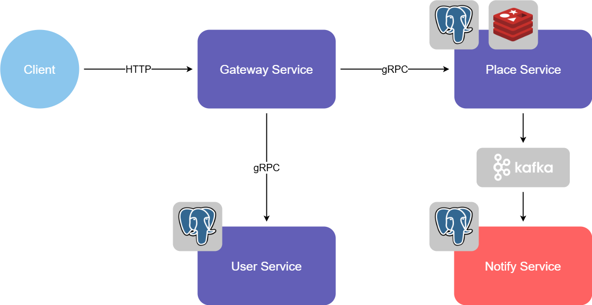

# :whale: Date Wishlist Hub Deploy

Центральный репозиторий проекта **Date Wishlist Hub**.

Ссылка на канбан-доску проекта: **[Date Wishlist Hub - Development](https://github.com/users/alexgul25/projects/2)**

*Общий стек технологий проекта:* `Go` `PostgreSQL` `Redis` `Kafka` `HTTP` `gRPC` `Protobuf` `Docker`

## :bulb: Идея проекта

**Date Wishlist Hub** - сервис, где каждый пользователь ведёт свой вишлист мест, которые он хотел бы посетить. Пользователи могут просматривать вишлисты, чтобы выбрать идею для совместной прогулки. Есть возможность подписки на пользователя, что позволяет получать уведомления на почту о появлении новых мест в вишлисте интересующего пользователя (на данном этапе письма на почту симулируются с помощью логирования).

## :jigsaw: Используемые микросервисы

- :globe_with_meridians: **[Gateway Service](https://github.com/alexgul25/gateway-svc)** - единая точка входа, через которую клиенты взаимодействуют со всеми внутренними сервисами.
- :round_pushpin: **[Place Service](https://github.com/alexgul25/place-svc)** - работа с данными о местах, добавленных пользователями.
- :busts_in_silhouette: **[User Service](https://github.com/alexgul25/user-svc)** - работа с данными о пользователях и подписках.
- :bell: **[Notify Service](https://github.com/alexgul25/notify-svc)** - асинхронная отправка уведомлений.
- :scroll: **[Protos](https://github.com/alexgul25/protos)** - общие `.proto` контракты.

## :building_construction: Архитектура проекта

<!-- markdownlint-disable MD033 -->
<p align="center">
  <picture>
    <source media="(prefers-color-scheme: dark)" srcset="docs/Date_Wishlist_hub_dark_v2.png">
    <source media="(prefers-color-scheme: light)" srcset="docs/Date_Wishlist_hub_light_v2.png">
    
  </picture>
</p>
<!-- markdownlint-enable MD033 -->

## :desktop_computer: Локальный запуск и работа через терминал

Систему можно запустить двумя способами:

- **[через Docker Compose](#2-запуск-через-docker-compose)** - одной командой, вся инфраструктура поднимается в контейнерах (рекомендуемый способ);
- **[без Docker](#3-запуск-без-docker)** - сервисы собираются и запускаются локально, инфраструктура настраивается вручную.

### 1. Клонирование нужных репозиториев

***ВАЖНО!*** Репозитории должны быть клонированы **в одну и ту же папку**. Всего необходимо клонировать 5 репозиториев.

- :whale: **Date Wishlist Hub Deploy** (этот репозиторий).

```bash
git clone https://github.com/alexgul25/date-wishlist-hub-deploy.git
```

```bash
git clone git@github.com:alexgul25/date-wishlist-hub-deploy.git
```

- :globe_with_meridians: **Gateway Service**.

```bash
git clone https://github.com/alexgul25/gateway-svc.git
```

```bash
git clone git@github.com:alexgul25/gateway-svc.git
```

- :round_pushpin: **Place Service**.

```bash
git clone https://github.com/alexgul25/place-svc.git
```

```bash
git clone git@github.com:alexgul25/place-svc.git
```

- :busts_in_silhouette: **User Service**.

```bash
git clone https://github.com/alexgul25/user-svc.git
```

```bash
git clone git@github.com:alexgul25/user-svc.git
```

- :bell: **Notify Service**.

```bash
git clone https://github.com/alexgul25/notify-svc.git
```

```bash
git clone git@github.com:alexgul25/notify-svc.git
```

### 2. Запуск через Docker Compose

#### 2.1. Подготовка окружения

В вашем дистрибутиве должны быть установлены и готовы к работе:

- Docker Engine с плагинами `compose` и `buildx`;
- утилита `curl`;
- утилита `jq`;
- утилита `make`.
Go, PostgreSQL, Redis и Kafka устанавливать не нужно: сервисы собираются внутри контейнеров, а инфраструктура запускается из готовых образов.

#### 2.2. Файл конфигурации

Создайте в корневой папке этого репозитория файл `.env` и заполните его (см. [.env.example](.env.example)).

```bash
cp .env.example .env
```

Обязательно задайте пароли и `JWT_SECRET`. Секрет можно сгенерировать с помощью команды:

```bash
openssl rand -base64 32
```

Файлы `.env` в репозиториях сервисов для этого способа запуска не нужны: все настройки сервисов описаны в [compose.yaml](./compose.yaml).

#### 2.3. Запуск и работа

Все команды выполняются из корневой папки этого репозитория.

1. `docker compose up --build -d` - соберите образы сервисов и запустите систему в фоне.
2. `docker compose ps -a` - убедитесь, что система запустилась: сервисы `kafka-init` и `*-migrator` завершились с кодом 0, остальные работают, у `gateway-svc`, `user-svc` и `place-svc` статус `healthy`.
3. `docker compose logs -f <имя сервиса>` - смотрите логи нужного сервиса (например, уведомления в `notify-svc`).
4. `docker compose down` - остановите систему, когда закончите работу. Данные PostgreSQL сохранятся до следующего запуска.

После запуска **Gateway Service** доступен по адресу `http://localhost:8082`. Как посылать запросы, описано в разделе [Работа с API](#4-работа-с-api).

<!-- markdownlint-disable MD033 -->
<details>
<summary>Что запускается</summary>

- **Инфраструктура:** `postgres`, `redis`, `kafka`. Наружу их порты не публикуются.
- **Одноразовые сервисы:** `kafka-init` создаёт топик `place.created`; `user-svc-migrator`, `place-svc-migrator` и `notify-svc-migrator` применяют миграции БД. После выполнения они завершаются.
- **Сервисы проекта:** `user-svc`, `place-svc`, `notify-svc`, `gateway-svc`. Они запускаются после готовности инфраструктуры и друг друга, порядок описан в [compose.yaml](./compose.yaml).
Для каждого сервиса с БД в PostgreSQL создаются отдельные пользователь и база данных (см. [init-databases.sh](./infra/postgres/init-databases.sh)).

</details>
<!-- markdownlint-enable MD033 -->

<!-- markdownlint-disable MD033 -->
<details>
<summary>Подсказки</summary>

- Если при сборке не удаётся скачать Go-модули (например, `proxy.golang.org` недоступен), укажите другой прокси в переменной `GOPROXY` файла `.env`.
- Если порт `8082` на вашей машине занят, укажите другой в переменной `GATEWAY_PORT` файла `.env`.
- Пользователи и базы данных создаются один раз, при первом запуске. Если вы изменили пароли БД в `.env` после первого запуска, удалите данные и запустите систему заново: `docker compose down -v`, затем `docker compose up --build -d`.
- `docker compose down -v` - остановить систему и удалить все данные.
- `docker compose up --build -d <имя сервиса>` - пересобрать и перезапустить один сервис после изменения его кода.

</details>
<!-- markdownlint-enable MD033 -->

### 3. Запуск без Docker

#### 3.1. Подготовка окружения

В вашем дистрибутиве должны быть установлены и готовы к работе:

- Go (версия 1.26.3+);
- утилита `goreman`;
- сервер PostgreSQL (версия 13+) и утилита `psql`;
- сервер Redis (версия 7+);
- сервер Kafka (версия 4.0+);
- компилятор Protocol Buffers (`protoc`);
- утилита `curl`;
- утилита `jq`;
- утилита `make`.

#### 3.2. PostgreSQL

Запустите сервер PostgreSQL, затем создайте пользователей и базы данных для **Place Service**, **User Service** и **Notify Service**.

<!-- markdownlint-disable MD033 -->
<details>
<summary>Примечание</summary>

Рекомендуется создать 3 разных пользователя и аналогично 3 БД, но если совсем лень, всё будет работать (❓) и для одного экземпляра 😁.

</details>
<!-- markdownlint-enable MD033 -->

```bash
sudo -u postgres psql -c "CREATE USER <имя пользователя> WITH PASSWORD '<пароль>';"
```

```bash
sudo -u postgres psql -c "CREATE DATABASE <имя БД> OWNER <имя пользователя>;"
```

Проверьте доступ.

```bash
psql -h localhost -U <имя пользователя> -d <имя БД> -c "SELECT 1;"
```

Если всё работает корректно, вы увидите следующий вывод:

```bash
 ?column? 
----------
        1
(1 row)
```

#### 3.3. Kafka

Запустите сервер Kafka. Если у вас отключено автоматическое создание топиков, создайте их самостоятельно (названия топиков см. в **[topics.go](https://github.com/alexgul25/place-svc/blob/main/internal/outbox/topics.go)**).

#### 3.4. Redis

Запустите сервер Redis. Затем можно создать пользователя и пароль для **Place Service**, но при локальной работе это необязательно :grin:.

#### 3.5. Файлы конфигураций сервисов

***ВАЖНО!*** Создайте в корневой папке каждого из четырёх сервисов файл `.env` для переменных окружения и заполните их в следующем порядке.

1. **User Service**.
2. **Place Service**.
3. **Notify Service**. `USER_SERVICE_ADDR` = `localhost:<порт, указанный для User Service>`.
4. **Gateway Service**. `JWT_SECRET` должен совпадать с указанным для User Service; `USER_SERVICE_ADDR` = `localhost:<порт, указанный для User Service>`; `PLACE_SERVICE_ADDR` = `localhost:<порт, указанный для Place Service>`.

<!-- markdownlint-disable MD033 -->
<details>
<summary>Подсказки</summary>

Переменные `DB_USER`, `DB_PASSWORD` и `DB_NAME`:

- используются в **Place Service**, **User Service** и **Notify Service**;
- заполняются значениями из шага [3.2.](#32-postgresql)

Переменная `KAFKA_PRODUCER_BROKERS`:

- используется в **Place Service**;
- заполняется значениями из шага [3.3.](#33-kafka)

Переменная `KAFKA_CONSUMER_BROKERS`:

- используется в **Notify Service**;
- заполняется значениями из шага [3.3.](#33-kafka)

Переменные `REDIS_CACHE_ADDR`, `REDIS_CACHE_PASSWORD`, `REDIS_CACHE_USERNAME`:

- используется в **Place Service**;
- заполняется значениями из шага [3.4.](#34-redis) Если не создали пользователя и пароль, оставьте соответствующие переменные пустыми.

</details>
<!-- markdownlint-enable MD033 -->

#### 3.6. Запуск и работа

Для удобства локальной работы в корне репозитория определёны **[Makefile](./Makefile)** и **[Procfile](./Procfile)** (нужен для запуска через `goreman`).

1. `make help` - узнайте о доступных командах.
2. `make run` - примените миграции для сервисов, использующих PostgreSQL; соберите все бинарники и запустите систему.
3. `Ctrl + C` - отправьте системе сигнал завершения, когда закончите работу.

### 4. Работа с API

Запросы к системе посылаются через **Gateway Service**. В отдельном терминале перейдите в его корневую папку и используйте команды Makefile.

- `make register` - зарегистрируйте пользователя.
- `make login` - авторизуйтесь (для удобства полученный JWT-токен будет сохранен в файл `.jwt` и вычитываться оттуда для запросов, требующих авторизации).
- `make search`, `make subscribe` и т.д. - работайте с API.

<!-- markdownlint-disable MD033 -->
<details>
<summary>Примечание для запуска через Docker Compose</summary>

Makefile **Gateway Service** берёт адрес сервера из переменной `SERVER_ADDR` файла `.env` в папке **Gateway Service**. При запуске через Docker Compose этого файла может не быть, тогда передавайте адрес явно:

```bash
make register API=http://localhost:8082
```

</details>
<!-- markdownlint-enable MD033 -->

## :world_map: План развития проекта

С задачами проекта, находящимися в работе прямо сейчас, можно ознакомиться на [канбан-доске](https://github.com/users/alexgul25/projects/2).

***Общие идеи для развития проекта в будущем.***

- Unit-тесты для бизнес-логики сервисов.
- Интеграционные тесты с testcontainers.
- Сбор метрик (Prometheus + Grafana).
- Реализация пользовательского интерфейса и запуск на сервере.
